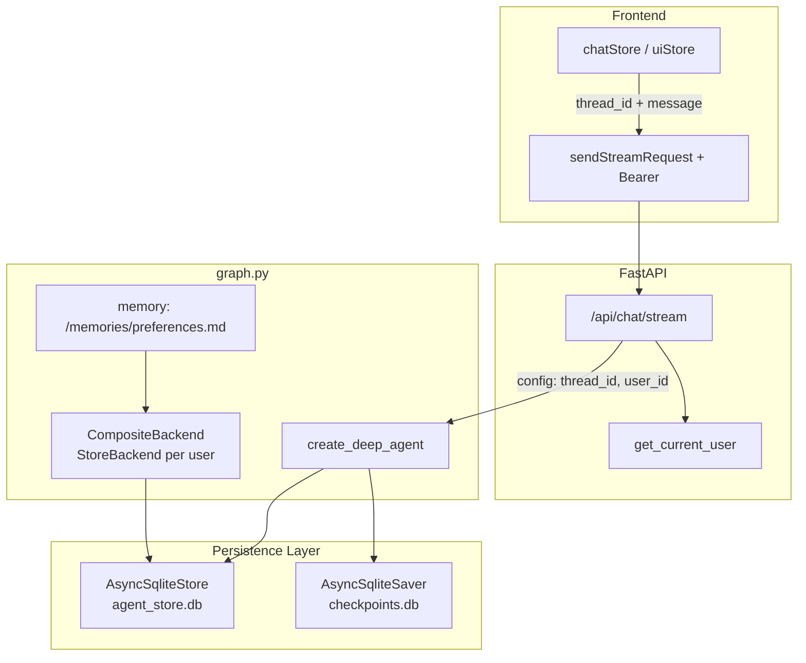

# 智能体持久记忆实现方案

## 目标与范围（已确认）

- **记忆层次**：两者都要 — 先 **对话线程记忆**（情景/短期），再 **跨会话长期记忆**（语义/偏好）
- **用户隔离**：长期记忆必须按 **JWT 登录用户** 隔离；Chat API 需鉴权

## 现状

当前 [`backend/src/agent/graph.py`](backend/src/agent/graph.py) 仅调用 `create_deep_agent(model, system_prompt)`，未配置 `checkpointer` / `store` / `memory`：

```5:8:backend/src/agent/graph.py
graph = create_deep_agent(
    model=llm,
    system_prompt="你是 ke-hermes 通用智能体，请根据用户的需求提供准确、有用的回答。",
)
```

[`backend/src/api/agent/agent_api.py`](backend/src/api/agent/agent_api.py) 每次请求只传入单条 `HumanMessage`，无 `thread_id`、无 `config`，对话无法延续。

前端 [`frontend/src/services/request.ts`](frontend/src/services/request.ts) 的 `sendStreamRequest` 使用裸 `fetch`，**未携带** `Authorization`（与 Axios 拦截器不一致）。

项目已有：`aiosqlite`、`DATABASE_URL`（SQLite）、`decode_token`（JWT `sub` = user_id），但 **尚无** `get_current_user` 依赖项。

---

## 架构总览



| 层次 | 机制 | 作用域 | 存储 |
|------|------|--------|------|
| L1 对话线程 | `checkpointer` + `thread_id` | 单次对话多轮上下文 | `checkpoints` 表（独立 SQLite 文件） |
| L2 长期记忆 | `memory=` + `StoreBackend` | 跨 thread、按 `user_id` | `store` 表（独立 SQLite 文件） |
| L3（可选，本期不做） | 后台 consolidation agent + cron | 从多 thread 提炼事实 | 写入 L2 |

与产品文案「三层架构」对齐：L1=情景记忆，L2=语义记忆，L3=后台巩固（后续迭代）。

---

## 阶段一：对话线程记忆（Checkpointer）

### 1. 依赖

在 [`backend/pyproject.toml`](backend/pyproject.toml) 增加：

- `langgraph-checkpoint-sqlite>=3.0.1`（含 `AsyncSqliteSaver`，项目已有 `aiosqlite`）
- `langgraph-store-sqlite`（`AsyncSqliteStore`，阶段二复用，可一并引入）

### 2. 持久化模块

新建 [`backend/src/agent/persistence.py`](backend/src/agent/persistence.py)：

- `CHECKPOINT_DB_PATH` / `STORE_DB_PATH`（默认 `backend/db/agent_checkpoints.db`、`backend/db/agent_store.db`，可通过 `Settings` 配置）
- `async def init_persistence() -> tuple[AsyncSqliteSaver, AsyncSqliteStore]`：在应用 lifespan 中 `setup()` / `asetup()`
- `async def close_persistence()`：关闭连接，避免 ASGI 进程 hang（LangGraph 文档要求）
- 模块级单例供 `graph` 与 API 使用

在 [`backend/src/server.py`](backend/src/server.py) `lifespan` 中调用 init/close（与现有 `init_db()` 并列）。

### 3. 改造 `graph.py`

```python
from agent.persistence import checkpointer, store  # 初始化后注入

graph = create_deep_agent(
    model=llm,
    system_prompt="...",
    checkpointer=checkpointer,
    # 阶段二再打开下面几项
    # store=store,
    # memory=["/memories/preferences.md"],
    # backend=...,
)
```

`create_deep_agent` 签名已支持 `checkpointer`、`store`、`memory`、`backend`（`deepagents>=0.6.1`）。

### 4. JWT 鉴权依赖

新建 [`backend/src/api/deps_auth.py`](backend/src/api/deps_auth.py)（或扩展现有 [`backend/src/api/deps.py`](backend/src/api/deps.py)）：

```python
async def get_current_user_id(authorization: str = Header(...)) -> str:
    # Bearer {token} -> decode_token -> return payload["sub"]
```

Chat 路由增加 `user_id: str = Depends(get_current_user_id)`，未登录返回 401。

### 5. 改造 Chat API

扩展 [`ChatRequest`](backend/src/api/agent/agent_api.py)：

```python
class ChatRequest(BaseModel):
    message: str = Field(min_length=1)
    thread_id: str | None = None  # 缺省时服务端 uuid7 生成并可在响应头/body 回传
```

调用方式（关键）：

```python
thread_id = req.thread_id or str(uuid7())
config = {"configurable": {"thread_id": thread_id}}

result = await graph.ainvoke(
    {"messages": [HumanMessage(content=req.message)]},
    config=config,
)
# 响应中附带 thread_id，供前端后续请求复用
```

流式接口 `astream_events` 同样传入 `config`。LangGraph 会从 checkpoint 恢复同 thread 的历史 `messages`，新消息通过 state reducer 追加（无需客户端重发全量历史）。

**安全**：校验 `thread_id` 归属 — 在 checkpoint metadata 或并行表 `conversation_threads(user_id, thread_id)` 中记录归属；`ainvoke` 前若 thread 已存在且 `user_id` 不匹配则 403。MVP 可在首次写入时把 `user_id` 写入 `configurable` 并依赖 LangGraph thread 隔离（同库不同 thread_id 即可，跨用户猜 thread_id 风险低但建议仍做 metadata 校验）。

### 6. 前端配合（阶段一）

- [`frontend/src/stores/ui.ts`](frontend/src/stores/ui.ts)：`HistoryItem` 增加 `threadId: string`（新建对话时 `crypto.randomUUID()`）
- [`frontend/src/services/request.ts`](frontend/src/services/request.ts)：`sendStreamRequest` 增加 `threadId` 参数；headers 增加 `Authorization: Bearer ${accessToken}`（复用现有 `getAccessToken()`）
- 响应解析 `thread_id`（若服务端新生成）写回当前 history

---

## 阶段二：跨会话长期记忆（Store + memory 文件）

### 1. 启用 Deep Agents 文件记忆

在 `graph.py` 完整配置：

```python
from deepagents.backends import CompositeBackend, StateBackend, StoreBackend

def _user_namespace(rt):
    # 自托管：从 runtime context 读取 user_id（见下）
    return (rt.context.user_id,)

graph = create_deep_agent(
    model=llm,
    system_prompt="...",
    checkpointer=checkpointer,
    store=store,
    memory=["/memories/preferences.md"],
    backend=lambda rt: CompositeBackend(
        default=StateBackend(rt),
        routes={
            "/memories/": StoreBackend(rt, namespace=_user_namespace),
        },
    ),
    context_schema=AgentContext,  # dataclass: user_id: str
)
```

API 调用时传入 runtime context（LangGraph）：

```python
await graph.ainvoke(
    input_state,
    config={"configurable": {"thread_id": thread_id}},
    context=AgentContext(user_id=current_user_id),
)
```

首次登录可为该用户 seed 空模板（`store.put((user_id,), "/memories/preferences.md", create_file_data("## Preferences\n"))`），见 [Deep Agents Memory 文档](https://docs.langchain.com/oss/python/deepagents/memory)。

智能体可通过内置 `edit_file` 在对话中更新偏好；`SummarizationMiddleware`（deepagents 默认）负责长对话压缩，与 checkpoint 互补。

### 2. 与业务库的关系

- **Checkpointer / Store**：专用 SQLite 文件，由 LangGraph 管理 schema，**不要**与 [`backend/db/ke-hermes.db`](backend/db/ke-hermes.db) 用户表混用同一连接
- 可选：新增 SQLAlchemy 表 `chat_threads(id, user_id, title, updated_at)` 供前端「历史列表」查询（当前 `uiStore.histories` 为本地 mock）；本期最小实现可仅持久化 graph 状态，列表仍前端 localStorage + thread_id

### 3. 配置项

在 [`backend/src/agent/config/config.py`](backend/src/agent/config/config.py) 增加：

```python
AGENT_CHECKPOINT_DB: str = "sqlite+aiosqlite:///./db/agent_checkpoints.db"
AGENT_STORE_DB: str = "sqlite+aiosqlite:///./db/agent_store.db"
```

`.env.example` 同步说明。

---

## 测试策略

| 用例 | 文件 |
|------|------|
| 同 `thread_id` 第二轮能引用上一轮内容 | `tests/unit_tests/test_agent_memory.py` |
| 不同 `thread_id` 不共享上下文 | 同上 |
| 用户 A/B 的 `/memories/preferences.md` 隔离 | 阶段二 |
| 无 token 调用 `/chat` 返回 401 | `tests/unit_tests/test_agent_api.py` |

现有 [`backend/tests/unit_tests/test_agent.py`](backend/tests/unit_tests/test_agent.py) 需 mock checkpointer 或在 fixture 中使用内存 saver（`MemorySaver`）避免测试污染 DB。

---

## 生产注意事项

- SQLite checkpointer/store：**适合开发与单机**；生产多实例应换 `AsyncPostgresSaver` + Postgres Store（同一套 API，仅换实现类）
- `StoreBackend` 在 async 路由中若出现 blocking 警告，关注 [deepagents#309](https://github.com/langchain-ai/deepagents/issues/309)；必要时对 store 操作使用 `asyncio.to_thread` 或升级 deepagents
- 设置 `LANGGRAPH_STRICT_MSGPACK=true`（checkpoint-sqlite 3.x 安全建议）

---

## 实施顺序（建议 PR 拆分）

1. **PR1**：`persistence.py` + lifespan + `checkpointer` + JWT dep + API `thread_id` + 前端 Bearer/threadId + 线程记忆测试
2. **PR2**：`store` + `memory` + `CompositeBackend` + `context_schema` + 用户隔离测试 + seed 逻辑

---

## 关键改动文件清单

| 文件 | 变更 |
|------|------|
| [`backend/src/agent/graph.py`](backend/src/agent/graph.py) | 注入 checkpointer / store / memory / backend |
| `backend/src/agent/persistence.py` | **新建** |
| [`backend/src/agent/config/config.py`](backend/src/agent/config/config.py) | DB 路径配置 |
| [`backend/src/server.py`](backend/src/server.py) | lifespan 初始化持久化 |
| [`backend/src/api/agent/agent_api.py`](backend/src/api/agent/agent_api.py) | 鉴权、thread_id、config、context |
| `backend/src/api/deps_auth.py` | **新建** `get_current_user_id` |
| [`backend/pyproject.toml`](backend/pyproject.toml) | 新依赖 |
| [`frontend/src/services/request.ts`](frontend/src/services/request.ts) | Authorization + thread_id |
| [`frontend/src/stores/ui.ts`](frontend/src/stores/ui.ts) / [`chat.ts`](frontend/src/stores/chat.ts) | thread 生命周期 |
